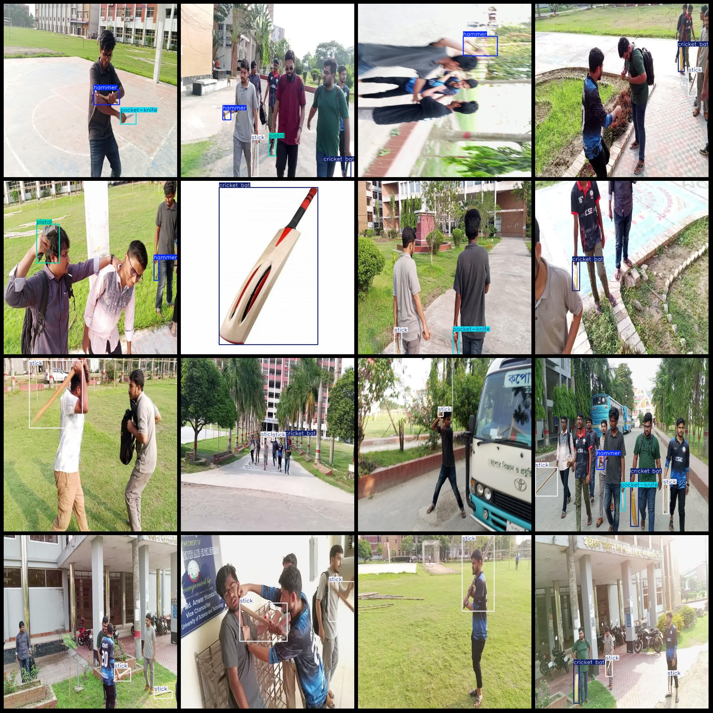
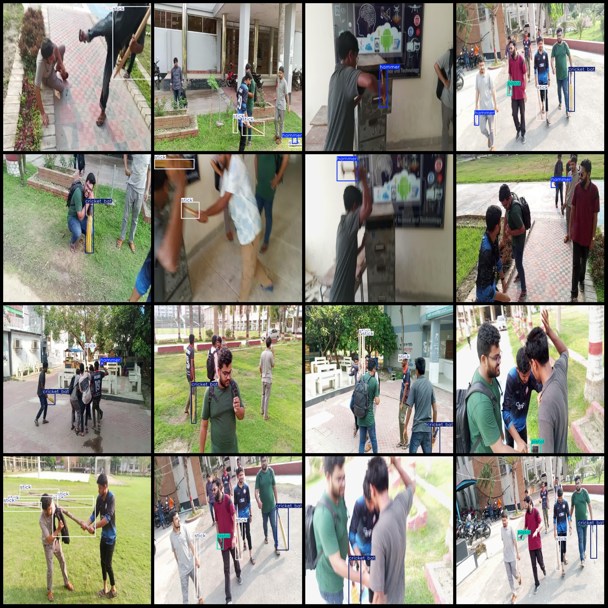

# Campus Dataset: Hazardous Items with Knives, Guns, Hammers, Scissors, and Sticks

**Dataset Format:** Pascal VOC format + YOLO format (excluding split paths in the txt file, only containing jpg images along with corresponding VOC-format xml files and YOLO-format txt files)

**Number of Images (jpg Files):** 804
**Number of Annotations (xml Files):** 804
**Number of Annotations (txt Files):** 804
**Number of Categories:** 5
**Labeled Categories Name:** ["cricket bat", "hammer", "pistol", "pocket-knife", "stick"]

**Number of Boxes for Each Category:**
- cricket bat : 323 boxes
- hammer : 225 boxes
- pistol : 112 boxes
- pocket-knife : 128 boxes
- stick : 872 boxes
Total Boxes: 1660

**Image Resolution:** 640x640

**Annotation Tool:** labelImg
**Annotation Rules:** Draw boxes around categories

**Important Notes:** There are no specific notes provided.

**Special Disclaimer:** This dataset does not guarantee the accuracy of trained models or weight files.

**Image Preview:** 

**Annotation Example:** 
## Images

Here is a pay link on Stripe ( https://buy.stripe.com/3cs8yP7sY87d0vu9AB ). Please contact me lonlonago@foxmail.com after funding $89, and I will send you a complete data files , thank you!

